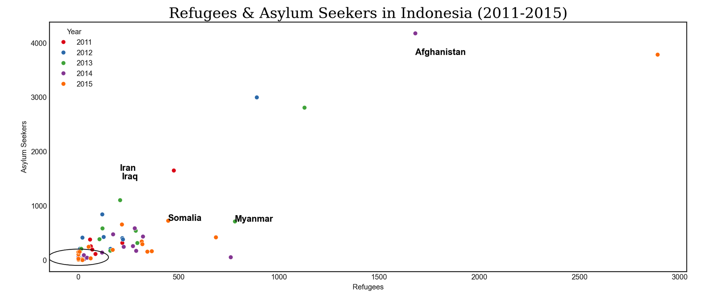

# REFUGEES & ASYLUM SEEKERS 
This project tries to analyze refugees and asylum seekers in Indonesia, and then also analyze Indonesians who are refugees and asylum seekers to find other countries to live in. This analysis aims to make new innovation graphs into visuals for open source using python. Temporary Data source collection from [UNHCR in Data World in Noah Ripper's account on Refugee Host Countries](https://data.world/nrippner/refugee-host-nations). Hopefully this project will be a guide for open source and transpiration.

## Refugees & Aslyem Seekers 2011-2015 in Indonesia
### Create Dataframe from Data Base 
```python

import csv 
import pandas as pd
datarefugeesidn1115 = pd.read_csv("/Users/mymac/Desktop/Data Github/datarefugeesidn.csv", delimiter=';', header = None) # adjust columns and rows
datarefugeesidn1115.columns = ['Year', 'Country', 'Origin', 'Refugees', 'AsylumSeekers', 'Total'] # create columns
datarefugeesidn1115 = datarefugeesidn1115.iloc[1:] # delete more columns
print(datarefugeesidn1115) #view data

 Year    Country                Origin  Refugees  AsylumSeekers Total
1    2011  Indonesia           Afghanistan     476.0         1649.0  2125
2    2011  Indonesia               Albania       0.0            1.0     1
3    2011  Indonesia            Bangladesh       0.0            2.0     2
4    2011  Indonesia  Central African Rep.       0.0            1.0     1
5    2011  Indonesia                 China      14.0           13.0    27
..    ...        ...                   ...       ...            ...   ...
171  2015  Indonesia                 Sudan     171.0          188.0   359
172  2015  Indonesia          Sierra Leone       0.0           24.0    24
173  2015  Indonesia               Somalia     448.0          724.0  1172
174  2015  Indonesia      Syrian Arab Rep.      61.0           32.0    93
175  2015  Indonesia                 Yemen       6.0          153.0   159
[175 rows x 6 columns]

```
### Refugees & Aslyem Seekers
```python

import pandas as pd
import seaborn as sns
import matplotlib.pyplot as plt
from matplotlib import style # import theme
print(plt.style.available) # list theme 

font1 = {'family':'serif','color':'black','size':20} #for title graph visual
plt.figure(figsize=(10,6))
sns.scatterplot(x = "Refugees", y ="AsylumSeekers", data = datarefugeesidn1115,
hue= "Year", palette="Set1")
plt.xlabel("Refugees")
plt.ylabel("Asylum Seekers")
plt.title("Refugees & Asylum Seekers in Indonesia (2011-2015)", fontdict = font1)
max_refugees_idx = datarefugeesidn1115["Refugees"].idxmax()
max_asylum_seekers_idx = datarefugeesidn1115["AsylumSeekers"].idxmax()
dominat_x = datarefugeesidn1115["Refugees"].iloc[max_refugees_idx]
dominant_y = datarefugeesidn1115["AsylumSeekers"].iloc[max_asylum_seekers_idx]
circle = plt.Circle((dominat_x, dominant_y), 150, color='black', fill=False, linewidth=1)
plt.gca().add_artist(circle)
plt.text(x=1681, y=3782, s="Afghanistan", fontsize=12, color='black', fontweight='bold')
plt.text(x=208, y =1649, s="Iran", fontsize=12, color='black',fontweight='bold')
plt.text(x=781, y=711, s="Myanmar", fontsize=12, color='black', fontweight='bold')
plt.text(x=448, y=724, s="Somalia", fontsize=12, color='black', fontweight='bold')
plt.text(x=217, y=1489, s="Iraq", fontsize=12, color='black', fontweight='bold')
plt.tight_layout()
plt.style.use('seaborn-v0_8-white') #theme
plt.show()

```


### Most Refugees & Asylum Seekers in Indonesia 2011-2015
Positive correlation if we see the general trend of the number of “Refugees” increasing along with the number of “Asylum Seekers”, this shows a positive correlation between the two variables. Although, it may show most people become Refugees, they tend to also become Asylum Seekers in Indonesia. Regarding outliers if the point is far from the general pattern. Like countries with the highest refugees but relatively fewer asylum seekers vice versa. This can be interesting for further analysis.
Afghanistan was the country with the highest number of refugees and asylum seekers in Indonesia in the period 2011-2015, indicating a significant humanitarian crisis at that time. In general, there may be a positive correlation between the number of refugees and asylum seekers, although further analysis is needed for countries with unusual patterns (outliers). Temporal analysis (by year) shows fluctuations, which may be related to political events or conflicts in the countries of origin of the refugees.

## Indonesian People Refugees and Asylum Seekers 
### Read Data Base
```python
import csv 
import pandas as pd

idrefugees = pd.read_csv("/Users/mymac/Desktop/Data Github/indonesiarefugees.csv", delimiter=';', header = None)# adjust columns and rows
idrefugees = idrefugees.drop('ExtraColumn', axis=1) # Delete more columns and rows unimportant
idrefugees.columns = ['Year', 'Country', 'Origin', 'Refugees', 'AsylumSeekers', 'Total'] # create columns
idrefugees = idrefugees.iloc[1:] # delete more columns
print(idrefugees) #view data

   Year           Country     Origin Refugees AsylumSeekers Total
1    2011         Australia  Indonesia    232.0          75.0   307
2    2011            Canada  Indonesia    368.0          47.0   415
3    2011       Switzerland  Indonesia      1.0           1.0     2
4    2011            Cyprus  Indonesia      1.0           7.0     8
5    2011           Germany  Indonesia    127.0           0.0   127
..    ...               ...        ...      ...           ...   ...
96   2015          Malaysia  Indonesia    782.0          37.0   819
97   2015       Netherlands  Indonesia     22.0           0.0    22
98   2015  Papua New Guinea  Indonesia   9368.0           0.0  9368
99   2015            Sweden  Indonesia      5.0          15.0    20
100  2015      UnitedStates  Indonesia   3183.0         979.0  4162

[100 rows x 6 columns]
```
### Analysis Indonesian People Refugees and Aslyum Seekers 2011 - 2015 
```python


```
