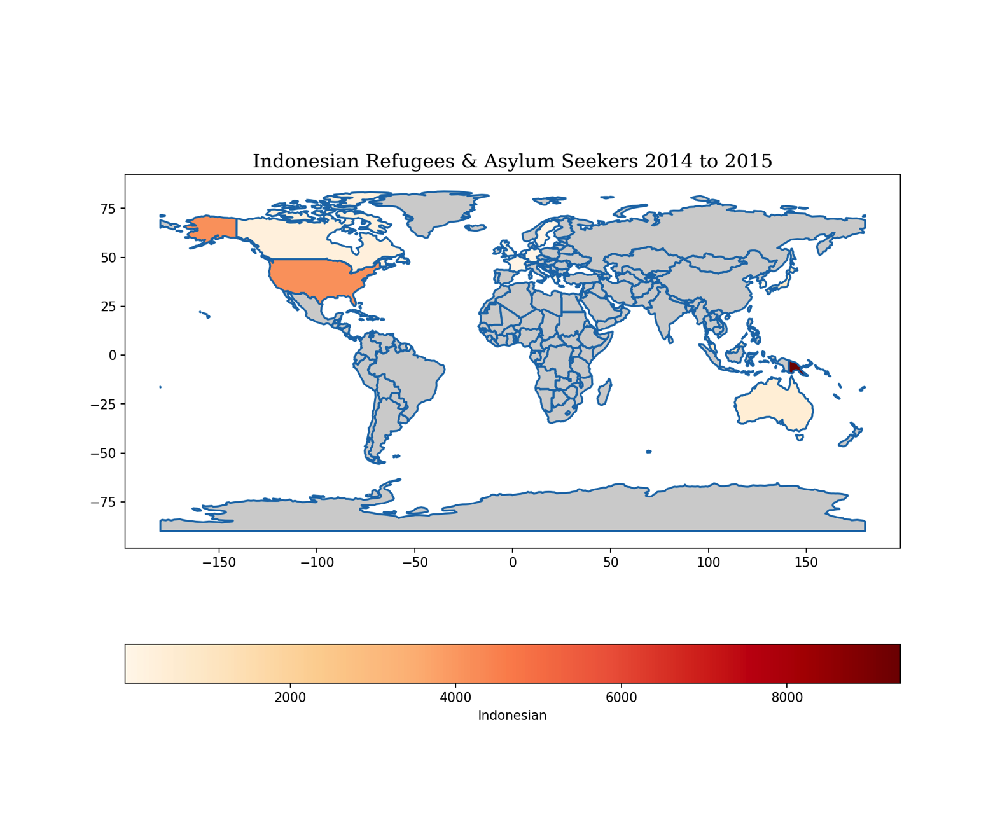

# REFUGEES & ASYLUM SEEKERS 
This project tries to analyze refugees and asylum seekers in Indonesia, and then also analyze Indonesians who are refugees and asylum seekers to find other countries to live in. This analysis aims to make new innovation graphs into visuals for open source using python. Temporary Data source collection from [UNHCR in Data World in Noah Ripper's account on Refugee Host Countries](https://data.world/nrippner/refugee-host-nations). Hopefully this project will be a guide for open source and transpiration.

## Refugees & Aslyem Seekers 2011-2015 in Indonesia
### Create Dataframe from Data Base
```python

import csv 
import pandas as pd
datarefugeesidn1115 = pd.read_csv("/Users/mymac/Desktop/Data Github/datarefugeesidn.csv", delimiter=';', header = None) # adjust columns and rows
datarefugeesidn1115.columns = ['Year', 'Country', 'Origin', 'Refugees', 'AsylumSeekers', 'Total'] # create columns
datarefugeesidn1115 = datarefugeesidn1115.iloc[1:] # delete more columns
print(datarefugeesidn1115) #view data

 Year    Country                Origin  Refugees  AsylumSeekers Total
1    2011  Indonesia           Afghanistan     476.0         1649.0  2125
2    2011  Indonesia               Albania       0.0            1.0     1
3    2011  Indonesia            Bangladesh       0.0            2.0     2
4    2011  Indonesia  Central African Rep.       0.0            1.0     1
5    2011  Indonesia                 China      14.0           13.0    27
..    ...        ...                   ...       ...            ...   ...
171  2015  Indonesia                 Sudan     171.0          188.0   359
172  2015  Indonesia          Sierra Leone       0.0           24.0    24
173  2015  Indonesia               Somalia     448.0          724.0  1172
174  2015  Indonesia      Syrian Arab Rep.      61.0           32.0    93
175  2015  Indonesia                 Yemen       6.0          153.0   159
[175 rows x 6 columns]

```
### Refugees & Aslyem Seekers
```python

import pandas as pd
import seaborn as sns
import matplotlib.pyplot as plt
from matplotlib import style # import theme
print(plt.style.available) # list theme 

font1 = {'family':'serif','color':'black','size':20} #for title graph visual
plt.figure(figsize=(10,6))
sns.scatterplot(x = "Refugees", y ="AsylumSeekers", data = datarefugeesidn1115,
hue= "Year", palette="Set1")
plt.xlabel("Refugees")
plt.ylabel("Asylum Seekers")
plt.title("Refugees & Asylum Seekers in Indonesia (2011-2015)", fontdict = font1)
max_refugees_idx = datarefugeesidn1115["Refugees"].idxmax()
max_asylum_seekers_idx = datarefugeesidn1115["AsylumSeekers"].idxmax()
dominat_x = datarefugeesidn1115["Refugees"].iloc[max_refugees_idx]
dominant_y = datarefugeesidn1115["AsylumSeekers"].iloc[max_asylum_seekers_idx]
circle = plt.Circle((dominat_x, dominant_y), 150, color='black', fill=False, linewidth=1)
plt.gca().add_artist(circle)
plt.text(x=1681, y=3782, s="Afghanistan", fontsize=12, color='black', fontweight='bold')
plt.text(x=208, y =1649, s="Iran", fontsize=12, color='black',fontweight='bold')
plt.text(x=781, y=711, s="Myanmar", fontsize=12, color='black', fontweight='bold')
plt.text(x=448, y=724, s="Somalia", fontsize=12, color='black', fontweight='bold')
plt.text(x=217, y=1489, s="Iraq", fontsize=12, color='black', fontweight='bold')
plt.tight_layout()
plt.style.use('seaborn-v0_8-white') #theme
plt.show()

```


### Most Refugees & Asylum Seekers in Indonesia 2011-2015
Positive correlation if we see the general trend of the number of “Refugees” increasing along with the number of “Asylum Seekers”, this shows a positive correlation between the two variables. Although, it may show most people become Refugees, they tend to also become Asylum Seekers in Indonesia. Regarding outliers if the point is far from the general pattern. Like countries with the highest refugees but relatively fewer asylum seekers vice versa. This can be interesting for further analysis.
Afghanistan was the country with the highest number of refugees and asylum seekers in Indonesia in the period 2011-2015, indicating a significant humanitarian crisis at that time. In general, there may be a positive correlation between the number of refugees and asylum seekers, although further analysis is needed for countries with unusual patterns (outliers). Temporal analysis (by year) shows fluctuations, which may be related to political events or conflicts in the countries of origin of the refugees.

## Indonesian People Refugees and Asylum Seekers in The World 
###  Data Base
```python
import geopandas as gpd
import pandas as pd
# file data from nautural earth # https://www.naturalearthdata.com/

world = gpd.read_file("/Users/mymac/Desktop/Data Github/ne_110m_admin_0_countries.shp")
world = gpd.read_file("/Users/mymac/Desktop/Data Github/ne_110m_admin_0_countries.dbf")
world = gpd.read_file("/Users/mymac/Desktop/Data Github/ne_110m_admin_0_countries.shx")


indonesianrefugeesseekers = {
    'Country': ["Australia", "Canada", "Germany", "France", "United Kingdom", "Greece",
                "Japan", "South Korea", "Malaysia", "Netherlands", "Papua New Guinea", 
                "Sweden", "United States of America"],
    'Indonesian': [494, 321, 27, 6, 24, 12, 854, 7, 819, 22, 9368, 20, 4162]
}

# Dictionary country coordinate  (longitude, latitude)
coords = {
    "Australia": (133.7751, -25.2744),#🇦🇺
    "Canada": (-106.3468, 56.1304),#🇨🇦
    "Germany": (10.4515, 51.1657), #🇩🇪
    "France": (2.2137, 46.6034),#🇫🇷
    "United Kingdom": (-3.4360, 55.3781), #🇬🇧
    "Greece": (21.8243, 39.0742), #🇬🇷
    "Japan": (138.2529, 36.2048), #🗾
    "South Korea": (127.7669, 35.9078), 
    "Malaysia": (101.9758, 4.2105), #🇲🇾
    "Netherlands": (5.2913, 52.1326), #🇳🇱
    "Papua New Guinea": (147.1803, -6.3149), #🇵🇬
    "Sweden": (18.6435, 60.1282), #🇸🇪
    "United States of America": (-95.7129, 37.0902) #🇺🇸
}

# convert to DataFrame
indonesianrefugeesseekers2015 = pd.DataFrame(indonesianrefugeesseekers)

#view data
print(indonesianrefugeesseekers2015)
                     Country  Indonesian
0                  Australia         494
1                     Canada         321
2                    Germany          27
3                     France           6
4             United Kingdom          24
5                     Greece          12
6                      Japan         854
7                South Korea           7
8                   Malaysia         819
9                Netherlands          22
10          Papua New Guinea        9368
11                    Sweden          20
12  United States of America        4162

# Combine dataframe with world (data shapefile)
world = world.merge(indonesianrefugesseekers2015, how="left", left_on="SOVERIGNT", right_on="Country")


```
### Population Indonesian People Refugees and Aslyum Seekers 2011 - 2015 
```python
import matplotlib.pyplot as plt

font1 = {'family':'serif','color':'black','size':15} # text for title

# plot maps world
fig, ax = plt.subplots(1, 1, figsize=(30, 18))

# plot chorpleth
world.boundary.plot(ax=ax) 
world.plot(column='Indonesian', ax=ax, legend=True,
cmap='OrRd',
missing_kwds={'color':'lightgrey'},
legend_kwds={'label':"Indonesian",
'orientation': "horizontal"})

world['centroid'] = world.geometry.centroid
plt.title("Indonesian Refugees & Asylum Seekers 2014 to 2015", fontdict=font1)
plt.show()

```


### Continues Analysis 
Total data on the number of refugees and asylum seekers in the world in 2015, most of the countries chosen by Indonesia such as Australia and the United States, which countries open migration policies for refugees and asylum seekers. Neighboring countries Australia and Malaysia are the first destinations because of easy access and strong bilateral relations. The next question is why is Papua New Guinea also a destination country for Indonesian migration? 

## Indonesian Refugees & Asylum Seekers 2011 - 2015
### Data Frame 
```python
import pandas as pd
import csv 
# import dataset 
indonesianrefugee = pd.read_csv("/Users/mymac/Desktop/Data Github/indonesianrefugees.csv", delimiter=';', header = None) # adjust columns and rows
indonesianrefugee = indonesianrefugee.iloc[1:]
indonesianrefugee.columns = ['Year', 'Seekers', 'Refugees'] # create colums 
print(indonesianrefugee)

# Data for Refugees
indonesianrefugee = pd.DataFrame({
    'Year': [2011, 2012, 2013, 2014, 2015],
    'Refugees': [16079, 15523, 14786, 14393, 13942]
})

# Data for Seekers
indonesianseekers = pd.DataFrame({
    'Year': [2011, 2012, 2013, 2014, 2015],
    'Seekers': [429, 506, 1968, 1892, 2194]
})
```
### Analysis Graph Indonesian Refugees & Asylum Seekers 2011 - 2015 
```python

import pandas as pd
import plotly.graph_objects as go


# Data for Refugees
indonesianrefugee = pd.DataFrame({
    'Year': [2011, 2012, 2013, 2014, 2015],
    'Refugees': [16079, 15523, 14786, 14393, 13942]
})

# Data for Seekers
indonesianseekers = pd.DataFrame({
    'Year': [2011, 2012, 2013, 2014, 2015],
    'Seekers': [429, 506, 1968, 1892, 2194]
})

# create Figure
fig = go.Figure()

# add trace for Refugees
fig.add_trace(go.Scatter(x=indonesianrefugee['Year'],
                         y=indonesianrefugee['Refugees'],
                         mode='lines+markers',
                         name="Indonesian Refugees",
                         marker=dict(color='red'),
                         line=dict(color='red')))

# add trave for Seekers
fig.add_trace(go.Scatter(x=indonesianseekers['Year'],
                         y=indonesianseekers['Seekers'],
                         mode='lines+markers',
                         name="Indonesian Seekers",
                         marker=dict(color='blue'),
                         line=dict(color='blue')))

# Update layout for title and element or others
fig.update_layout(title="Indonesian Refugees & Asylum Seekers 2011 - 2015",
                  xaxis_title="Years",
                  yaxis_title="Indonesian",
                  plot_bgcolor='rgb(17,17,17)',
                  paper_bgcolor='rgb(17,17,17)',
                  font=dict(color="white"),
                  xaxis=dict(showgrid=False),
                  yaxis=dict(showgrid=False),
                  showlegend=True)
                  
fig.update_xaxes(tickvals=[2011,2012,2013,2014,2015])

# show plot
fig.show()


```

### Interpetation Result


